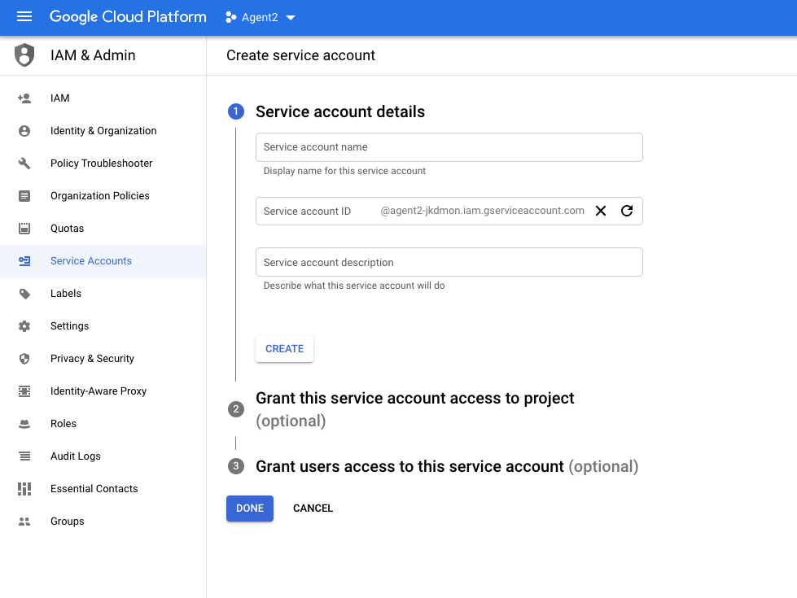
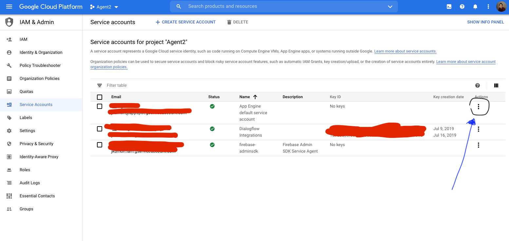
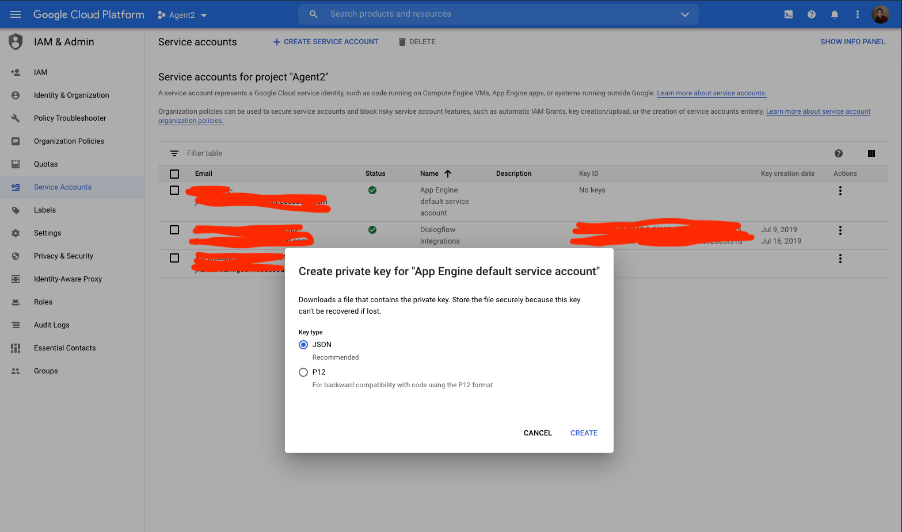
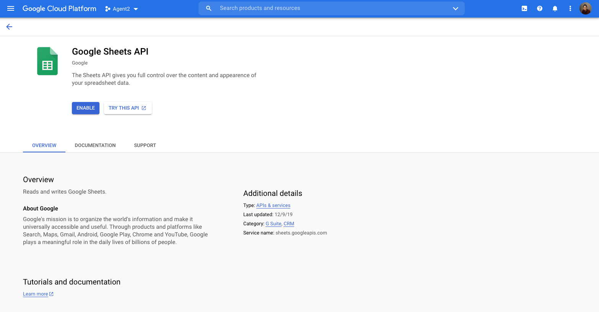

# GM / Sterling Middleware
  
  
  
  
## Getting Started
The GM / Sterling Middleware includes a series of APIs used to authenticate against the Google Sheets API to read and write data to a designated spreadsheet.  
  
## Setting up your environment
1. Install [node.js 14.0](https://nodejs.org/en/download/)
2. `git clone` the repo and `cd gm-sterling-middleware`
2. Run `npm i --save` to install all node dependencies
3. Run `npm run start-dev` to start in development environment
4. Run `npm run start-prod` or simply `npm run start` to start in production environment  
  
## Environment Variables
* `ss_id`=spreadsheet id
* `username`=basic auth user
* `password`=basic auth pw
* `type`=service_account
* `project_id`=project id
* `private_key_id`=private key id
* `private_key`=your private key
* `client_email`=client email
* `client_id`=client id
* `auth_uri`=auth uri
* `token_uri`=token uri
* `auth_provider_x509_cert_url`=auth cert url
* `client_x509_cert_url`=client cert url  
  
## Gitignore
* `/node_modules/`
* `.env`
* `credentials.json`  

## Use Case
**So let's talk about what led us to this solution. Our client was interested in building bot that was able to read and write customer opt-in information after an order had been submitted and to use the LP proactive messaging platform to send custom messages to customers – assuming that these correlates with the opt-in information newly received.** 

**Since the client did not have a REST API to interface with our bots, we had to find a way to produce the read/write functionality with what was being offered. The information would come through their SFTP Server in the form of two xlsx spreadsheets: the first with opt-in information and the second with push notifications for proactive messaging. The first had five columns: 1) order number, 2) old phone number, 3) new phone number, 4) opt-in (y/n), and 5) date of opt-in. The second with two columns: 1) phone number, and 2) message.**

**The ask would be to pick up these two sheets on a daily basis, have the LP bot read/write information from the first sheet upon customer request, and to drop off the newly revised sheet the following day. With the second sheet, to take the list of corresponding numbers and messages and to push them out at a set time each day.**

**We believed that the only way to interface with spreadsheet information from a REST API was to find a way to bring the spreadsheet data into Google Sheets. But since there was no way to package the google service account details to authenticate directly with LP bots and there were more API needs then simple bot interfacing, we decided to build a middleware that talks to google sheet through API endpoints. This way, as the needs expanded, we could continue to augment the information in the spreadhsheet for this solution's purposes.**

## Architecture
**The GM / Sterling solution is part of a larger infrastructure that is built with three composite parts. The middleware you see here will make more sense when seen in this context. These parts include 1) the file pickup/dropoff, 2) the middleware, and 3) the proactive messaging delivery apparatus.**
.png)

1. **The File Pickup/Dropoff**.png)
We are using integromat to schedule our integration with between GM's SFTP server and our Google Drive. Since our middleware can only talk to designated sheets that have been permitted through our GCP service account, we couldn't just drop a file and have the middleware begin speaking to it right away. The file would be newly created with its own unique information. 

We decided that we would drop the file in an accessible location and schedule a google apps script (GAS) to search by the date appended to the file name. It would pull the range of that file into the central spreadsheet being read on a set time everyday. Two schedulers have been configured here to perform this operation programmatically: 1) integromat connection scheduled (file transfer from SFTP to Google Drive), and 2) app script scheduled with a GAS trigger. Dropoff is also scheduled with integromat to transfer google drive file back into SFTP server. 

2. **The Middleware**.png)
The Middleware is build with Javascript and Nodejs. It uses Expressjs to develop API endpoints which are further described in the last part of this readme. The bot uses two separate endpoints in the middleware to read/write opt-in information. The other APIs are used to retrieve push notifications from the second sheet given to us and to log the information of proactive campaign jobs so that we can check on the status of it's delivery when they are complete. 

3. **The Proactive Messaging Delivery Apparatus**.png)
We use LP's FaaS platform to perform our proactive message deliveries through two functions that are invoked by daily schedules. 

The first function asks the middleware for the push notification information and schedules the deliveries through the proactive messaging api. Once scheduled, it takes the response back from the api (jobs scheduled) and logs it into a third spreadsheet we've created for tracking in aforementioned google sheet. The second function is a retry function that retrieves the logged information, inquires proactive of each job's status, and proceeds to retry each upon failure. 

## Setting up Google Service Account
1. **Create a service sccount on google cloud console**  
  
  
2. **Create a private key associated to your newly create service account**  
  
  
3. **Confirm the format of key file to be downloaded in JSON**  
  

4. **If you're just using in dev, create a `credentials.json` file and copy and paste private key JSON into it, otherwise save the information in the proper environment variables**  

5. **Enable Google Sheets API under the newly created service account in the `APIs & Services` tab**  
  
  
6. **Grab the spreadsheet id you want to interface with from the URL of the google spreadsheet and assign it to `ss_id` env var and share with the `client email` from the private key**  

7. **You should be all set to go!**

## APIs
* Each API uses Basic Authentication and the user/pw info is saved in the `.env` file
* POST `/api/optins/check-order-info` - takes two strings, an `orderNumber` and `phoneNumber` (required), and checks SS; if no order number, it'll verify if phone number exists and spit out the corresponding order number, else it will check for order number in payload and update phone number if different from listed 
* POST `/api/optins/opt-in-yes` - takes a string, `orderNumber`, and logs the opt-in information in SS
* GET `/api/notifications/get-push-notifications` - gets all push notifications from from SS
* POST `/api/notifications/get-push-notifications-by-phone` - takes an array of `phoneNumbers` and retrieves the push notifications for each
* POST `/api/proactive/log-proactive-campaigns` - takes an payload with a string, `proactiveCampaignId`, and an array of objects `acceptedConsumers` w/ string `id` and `phoneNumber` which should return from proactive API and logs results into the SS
* GET `/api/proactive/get-proactive-campaign-status` - gets the recently scheduled proactive campaign info saved into SS and clears the SS of the info
* GET `/api/healthcheck` - checks that the application is up and running